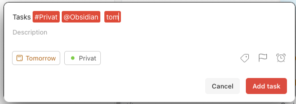
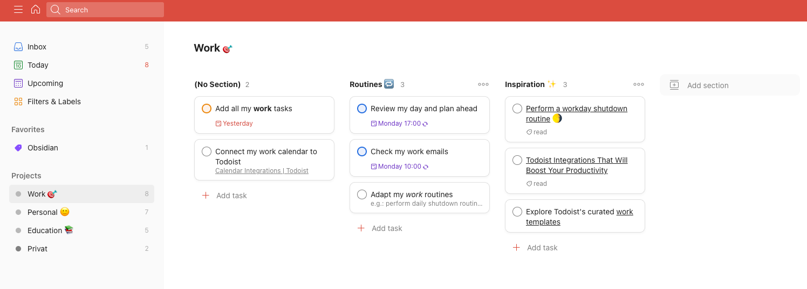
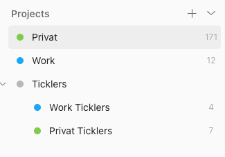
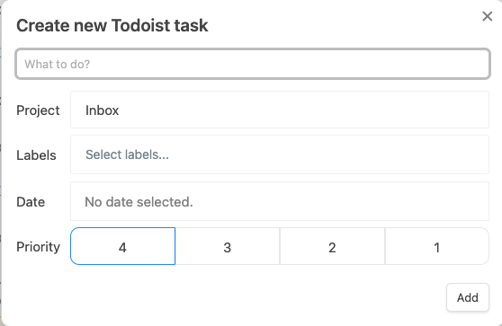
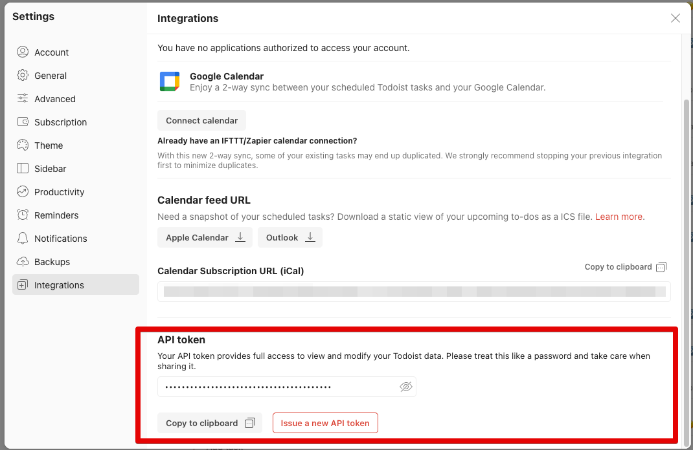
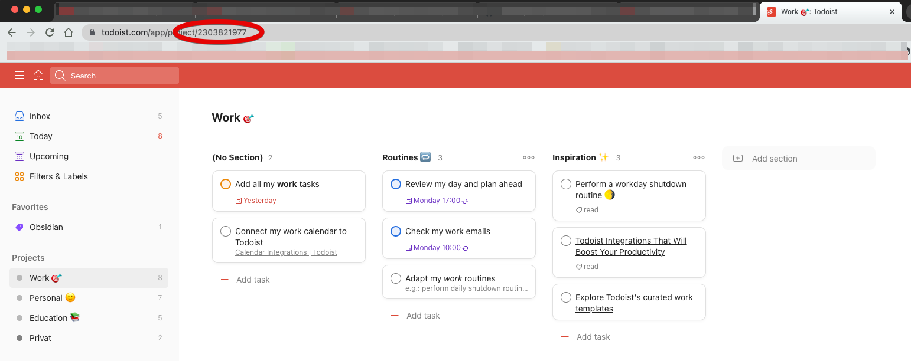

Hallo und Willkommen,

heute mal wieder ein richtiges Review eines Plugins und zwar das [Todoist Sync Plugin](https://github.com/jamiebrynes7/obsidian-todoist-plugin). Es gibt noch weitere Plugins für Todoist auf die ich auch kurz eingehe.

Aber bevor wir mit Todoist anfangen noch ein kleines Update: [Better Word Count](https://github.com/lukeleppan/better-word-count) wurde geupdated und unterstützt jetzt alle Funktionalitäten die auf der Webseite genannt sind. Es sollen noch mehr Funktionen kommen und ich werde dann ein neues Video machen.

Aber nun zu Todoist:

Ich nutze das Todoist Sync Plugin, da ich so alle meine ToDos im Überblick habe. Die für die Arbeit und meine Privaten.

Das [Tasks Plugin](https://github.com/obsidian-tasks-group/obsidian-tasks) nutze ich für Dinge die nur in Obsidian sind. Den Unterschied zeige ich später noch einmal genauer auf.

Schauen wir uns kurz [Todoist](https://doist.grsm.io/1wx938b4rtun) an und danach das Plugin.

## Todoist Übersicht

Todoist ist eine typische Produktivität App, die aber ein paar kleine, aber nette, Dinge mitbringt.

- QuickAdd incl. automatischer Datumserkennung (Ich habe aber keine Ahnung wie gut die Deutsche Version davon ist.)



- Templates - Vorschläge für bestimmte Abläufe, also Tasks mit Subtasks Strukturen
- Collaboration - Verteilen von Tasks an andere
- Team Support - Erweiterte Funktionen für Teams
- Verschiedene Ansichten für die Tasks incl. Kanban Style



- Email Integration
- Integration mit vielen anderen Apps.

Die freie Version reicht für die meisten Leute wohl aus. Für mich ist die größte Limitierung nur 5 Projekte haben zu können.



Auch sind die Integrationen wichtig für mich, da ich Fantastical, Spark und Outlook nutze. Und alle funktionieren sehr gut mit Todoist zusammen.

Ich mag auch die Templates, nicht das ich die wirklich in Todoist benutze, aber ich benutze manche der Ideen in Obsidian.

Aber jetzt mal zu dem was euch wohl ehr interessiert, dem Todoist Sync Plugin für Obsidian.

## Übersicht Todoist Sync Plugin

Das Todoist Sync Plugin hat 2 Funktionalitäten:

- Anzeigen von Tasks
- Erstellen von Tasks

### Anzeigen von Tasks

Das Anzeigen von Tasks geschieht mit Hilfe von Codeblocks:

````
```todoist
{
"name": "Alle Tasks",
"filter": "today | overdue"
}
```
````

Diesen kann man ein wenig anpassen:

| Name | Notwendig | Beschreibung | Type | Standard |
| --- | --- | --- | --- | --- |
| name | X | Der Titel vor der Abfrage. Ihr könnt die `{task_count}` Variable nutzen, welche dann mit der Anzahl der Aufgaben ersetzt wird. | string | |
| filter | X | Ein korrekter [Todoist Filter](https://get.todoist.help/hc/en-us/articles/205248842-Filters) (eng) | string | |
| autorefresh | | Nummer in Sekunden für die automatische Neuabfrage. Falls nicht vorhanden, wird der Standard genutzt. | number | null |
| sorting | | Sortierreihenfolge. Kann 'priority', 'dateAscending' (oder auch 'date'), 'dateDescending', oder eine Kombination sein. | string[] | [] |
| group | | Gibt an ob die Abfrage die Ergebnisse zusammengefasst nach Priorität und Abschnitt darstellen soll. | bool | false |

Am Wichtigsten ist hierbei allerdings der Filter, hiermit definiert ihr was alles angezeigt werden soll.

Wollt ihr euch z.B. alle Tasks anzeigen lassen die Heute fällig sind oder schon überfällig, aus dem Privaten Projekt sind und nicht den Label Obsidian enthalten sieht der Filter so aus:

```
"filter": "(today | overdue) & #Privat & !@Obsidian"
```

Wie ihr sieht, ist die Syntax dieselbe die ihr auch beim Anlegen von Tasks in Todoist nutzen könnt.

### Erstellen von Tasks

Das erstellen von Tasks geschieht über Befehle. Es gibt zwei Stück

- Erstellen eines Tasks mit dem markierten Text
- Erstellen eines Tasks mit einem Link zur Notiz.

Aktuell funktioniert der erste Befehl "Erstellen eines Tasks mit dem markierten Text" nicht richtig, der markierte Text wird nicht kopiert.

Außerdem solltet ihr nicht zu schnell Enter drücken, weil dies den Task erstellt. Also immer schön TAB nutzen.



### Pros

- Gute Integration in Obsidian mit dynamischen Updates und der Möglichkeit die Tasks zu komplettieren.
- Möglichkeit der Erstellung von Tasks inkl. Link zur Notiz.

### Cons

- Markierter Text wird nicht in den Task übernommen (Bug)
- API Abfragen schlagen teilweise fehl
- Könnte mal ein Update gebrauchen.
- Unterstützt nicht [Obsidian Advanced URI](https://github.com/Vinzent03/obsidian-advanced-uri)

### Todoist API Token

Das API Token für das Plugin bekommt ihr über [https://todoist.com/prefs/integrations](https://todoist.com/prefs/integrations)



Diesen Link könnt ihr auch auf der Plugin Seite finden, genauso wie den Link zu den Filtern. Oder halt hier 😀

Stellt sicher das ihr die Datei **.obsidian/todoist-token** nicht mit eurem Vault verteilt.

## Bonus Tip

Da wir schon über die Nutzung von Obsidian mit Todoist reden hier hoch ein kleines "Schmankerl". Ihr könnt auch über [Buttons](https://github.com/shabegom/buttons) direkt die Todoist App ansprechen. Um z.b. einen neuen Task zu erstellen:

````
```button
name Create New Todoist Task
type link
class obsidian-button
action todoist://addtask
```
````

Oder um ein bestimmtes Projekt zu öffnen.

````
```button
name Open Todoist Privat Project
type link
class obsidian-button
action todoist://project?id=2303822263
```
````

Die Projekt Nummer die ihr dafür benötigt erhaltet ihr in der Weboberfläche von Todoist. Wenn ihr dort ein Projekt anklickt, findet ihr die Projekt Nummer in der URL.



Eine Beschreibung der verschiedenen Parameter die ihr benötigt könnt ihr unter [Mobile URL Schemes](https://developer.todoist.com/guides/#mobile-app-url-schemes) finden.

Auf dem Mac funktionieren die mobilen URL Schema auch.

## Todoist oder Tasks

Wann nutze ich Todoist und wann Tasks?

Ich nutze Tasks eigentlich nur für Dinge die ich in Obsidian auch bearbeiten kann. Zum Beispiel in meiner Tagesnotiz als Erinnerung das ich bestimmte Dinge tun soll wenn ich an diesen Punkt angekommen bin.

Oder in Gesprächsnotizen als Erinnerungen, das ich da vielleicht noch was tun muss. Oft werden dann diese Tasks dann in Todoist Tasks umgewandelt und in Obsidian abgeschlossen.

Todoist nutze ich für alle Dinge die halt nicht komplett in Obsidian stattfinden. Reifenwechsel, Wiederkehrende Erinnerungen, etc. Aber halt auch als Einstiegspunkt für die o.g. Tasks. Dann direkt mit dem Link auf die Notiz.

Es gibt da aber keine scharfe Grenze. Alles ist im Fluß.

## Urteil

Für mich tut das Plugin was es soll. Ich weise die Aufgaben keinen anderen Leuten zu und aktuell reichen mir die Möglichkeiten die es bietet. Ich habe schon mal überlegt ob ich mir gerne in den Daily Notes auch die vollendeten Tasks des Tages anzeigen lassen will, aber momentan sind meine Daily Notes sowieso schon voll gepackt mit Informationen. Und einen wirklichen Nutzen kann ich da momentan auch nicht erkennen.

Ab und zu habt ihr das Problem das keine Tasks angezeigt werden, dann liegt das aber an den zu häufigen Abfragen an Todoist. Zur Not gibt es ja die Todoist App.

Ich nutze die App auch um einfach Tasks zu erstellen, Obsidian und Tasks erzeugt einfach zu viel "Wiederstand" beim anlegen unterwegs.

Wenn etwas Bezug zu Notizen in Obsidian hat nutze ich die Funktionalität des Plugins und erstelle die Tätigkeiten mit Hilfe der Befehle.

## Erwähnenswerte Kleinigkeiten

Wie gesagt gibt es noch andere Todoist Plugins, diese benutze ich allerdings nicht, da ich so viel wie möglich mit [Templater](https://github.com/SilentVoid13/Templater) automatisiere und die Benutzung von Befehlen (oder Buttons) vermeide (Ausnahmen bestätigen die Regel). Last mir doch einen Kommentar da, wenn ich diese auch Vorstellen soll.

- <https://github.com/dennisseidel/obsidian-todoist-link> (Nutzt Notizen als Projekte und Zeilen in den Notizen als Tasks)
- <https://github.com/wesmoncrief/obsidian-todoist-text> (Ein Markdown Ansatz, benötigt Befehle und einen Marker im Text)
- <https://github.com/Ledaryy/obsidian-todoist-completed-tasks> (Trägt Completed Tasks in Notizen ein, benötigt Befehle und Marker im Text)
- <https://github.com/Ellpeck/ObsidianCustomFrames> (Erlaubt die Integration der Todoist WebApp)

## Fazit

Für mich passt das Plugin und Todoist in meine Prozesse. Das Tasks Plugin deckt andere Bereiche ab und wird auch von mir genutzt.

Aber ich denke nicht das ich mein komplettes Task Management in Obsidian machen werde. Vor allen Dingen stört mich dabei die Haptik auf meinem Telefon. Da funktioniert Todoist doch um längen besser als Obsidian.

Wie geht ihr mit eueren Tasks um? Nutzt ihr Todoist, Obsidian oder einen anderen Ansatz?

Lasst es mich in den Kommentaren wissen.

## Fußnote

- [Der Film zum Artikel](https://youtu.be/DFe4zCxhoWU)
- [Mein Youtube Video Vault](https://github.com/MMoMM-org/obsidian-youtube-vault)
- 40-04
- #Tasks
- #Templater
- #Buttons
