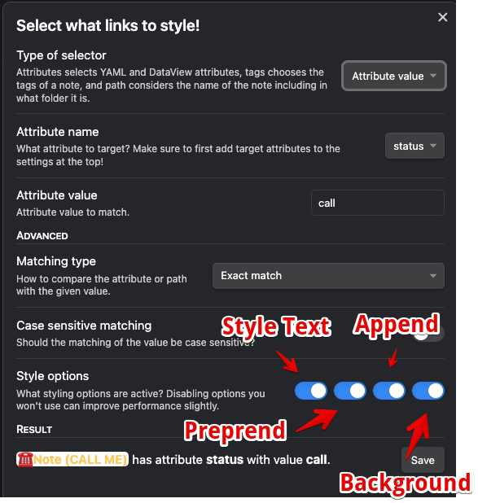
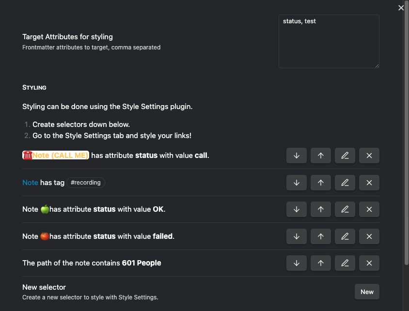
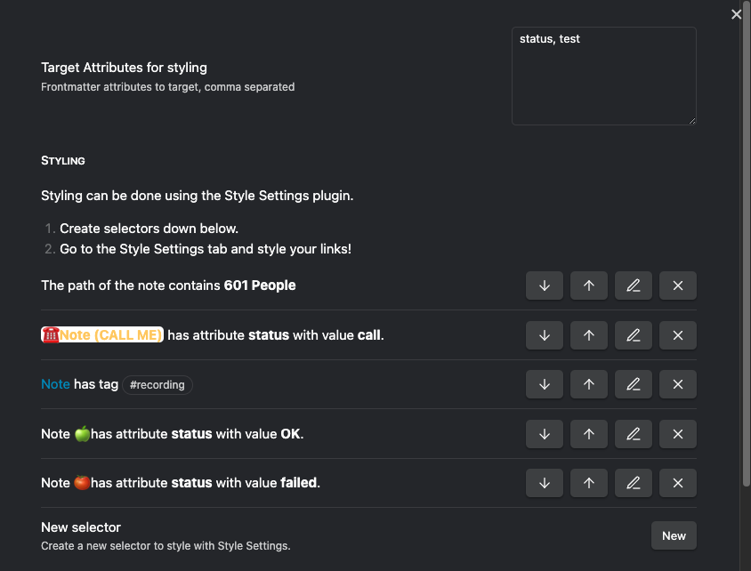
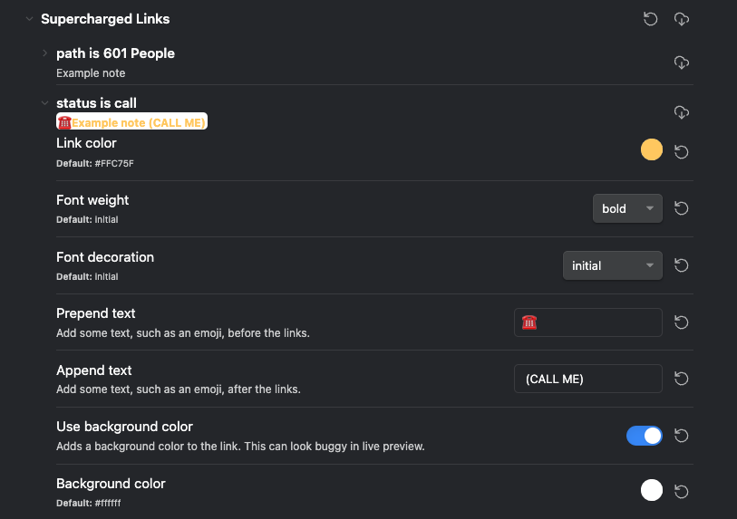
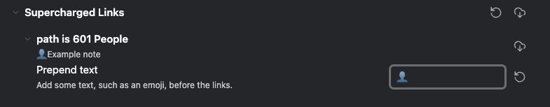
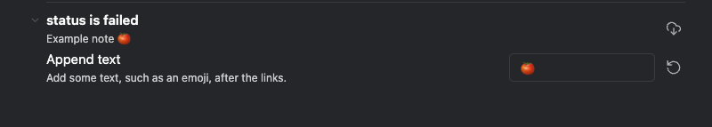
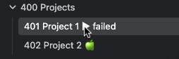
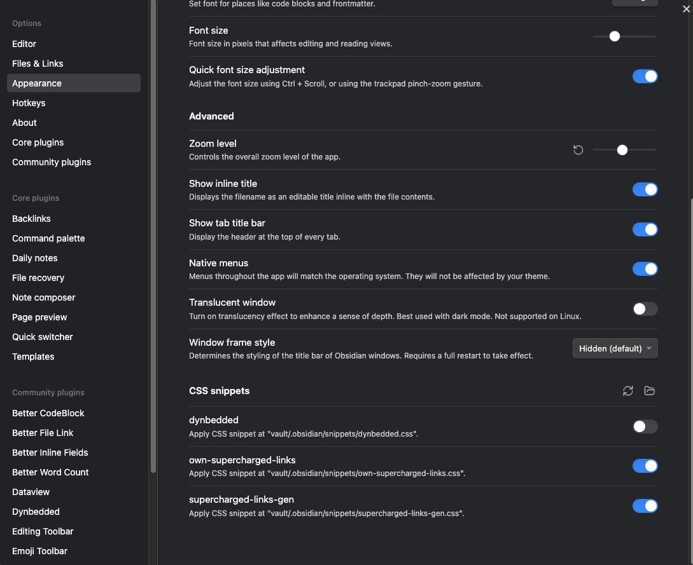
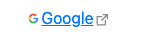

Hello and welcome,

let's take a look today into how we can bring some more oomph into Obsidian. Let's supercharge it with [Supercharged Links](https://github.com/mdelobelle/obsidian_supercharged_links).

The plugin allows us to mitigate the issue with emojis in note names and can deliver more information via an Obsidian Link that itself by giving us additional visual cues.

A lot of Obsidian example vaults use emojis in their note names to make them more visual and to transfer additional easy recognisable information. There is a problem with that though. Some alternative synchronisation tools, like Dropbox, or other operating system besides Linux don't like them.

Obsidian itself doesn't support [] in a note name.

But Supercharged Links is able to cover this gap.

## Overview

## 

So what does the plugin do?

It allows you to change the way an Obsidian Link is formatted based on your own rules. It not only works in a note but also in the Folderview and other plugins (for an extensive list please take a look at the github page)

Supercharged Links defines the rules, the styling is being done by [Style Settings](https://github.com/mgmeyers/obsidian-style-settings) , so there is no real need to create your own CSS snippets.

You can style the following:

- Link Color
- Font Weight aka Bold
- Underline, overline and line though
- Prepend text
- Append text
- Link background (doesn't always work in PreView Mode)


Supercharged Links - Style Möglichkeiten

And you can change the links based on :

- Tags
- Inline / Frontmatter Fields
- Path


Supercharged Links - Regeln

You can also reorder the rules.



Supercharged Links - Geänderte Regel Reihenfolge

The rules are executed after each other, the last rule wins. But only the options you have selected of a rule will overwrite the other options, it is not a full replace.

After defining the rules you can define the styling. You need to switch over into the Style Settings configuration and you can then change the styling under Supercharged Links.



Style Settings - Supercharged Links

## Pros

You change the rules and styling at a central place. If you finally want to switch from you old trusty landline phone ☎️ to your mobile 📱 you only need to change your styling. You don't need to change all your note names.

On top of that everything is only visual, no data is changed.

And due to Style Settings you don't need to create custom CSS snippets.

## Cons

The example CSS snippet on the webpage are not very informativ, on the other side you don't need them anymore normally.

It can also be difficult to achieve the result you really want if you aim too high. 😀

## Usage Examples

I like to have the 👤 (Bust) Emoji in front of my people notes (even if they already start with an @).

> @, #, {, §, & belong to a set of characters you shouldn't normally use in filenames. They work for me on Windows / macOS and iCloud / OneDrive / Dropbox..

Don't forget to add a space if needed if you prepend or append text!



Supercharged Links - Personen

An other example would be to show a status directly next to the note name.

I personally use tags to track the status of a project, but you can of course also use an attribute (Frontmatter / Dataview Inline Field).

Based on the status I then have a visual cue next to my note name.



Supercharged Links - Status

And there are still some things which require you to create custom CSS snippets and don't work with the Style Settings.

An example would be to show the value of the status attribute only if you hover over the note name with your mouse.



Supercharged Links - Status Anzeige

```
.data-link-icon-after[data-link-status]:hover::after{
    content: " ► "attr(data-link-status)
}
```

You need to create a file in .obsidian/snippets, let's call it own-supercharged-links.css and paste the code snippet from above into it..

After that you need to enable it in the Obsidian configuration under Appearance / CSS snippets.

  

Small drawback: If the status attribute is empty we will see a **null**. If you have the answer to the problem or have other cool snippets let me know.

## How do I use it?

You have already seen some examples above. How do I use Supercharged Links in general?

I put emojis in front of my note names which reflect the kind of note in a visual way:

- 🔗 for bookmarks
- 👤 for people
- 📚 for resources
- etc

And some notes have after the name an indicator for the status:

- 🏁 for done
- 🟢 for OK
- etc

This makes it easy to see which kind of note is behind a link and also in which state the note is.

But I don't overuse this 😀

## Verdict

It was never easier since the integration with Style Settings, to dynamically style Obsidian Links based on your own wishes via rules.

Obsidian links gain the additional information on first sight. You shouldn't overdue it though.

## Noteworthy Tidbits

## 

If you want to give your external links some love you can use [Link Favicon](https://github.com/joethei/obsidian-link-favicon). It only adds the favourite icon in-front of the external link but even that makes the links better visible.



Link Favicon

## Conclusion

## 

In the beginning I liked the idea to use emojis to make my notes more visual. Then i quickly realised it caused all kind of problems with Dropbox and OneDrive.

Due to Supercharged Links I can style my links and note names visually and can deliver additional information.

And as already said: Do you have cool CSS snippets for Supercharged Links? Let me know in the comments.

## Footnote

- [The movie of the post](https://youtu.be/IUpG0LEL7Yg)
- [My Youtube Video Vault](https://github.com/MMoMM-org/obsidian-youtube-vault)
- 40-05
