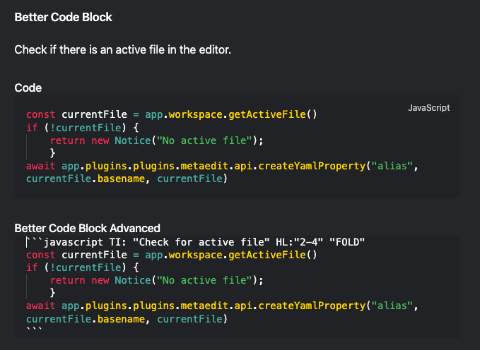
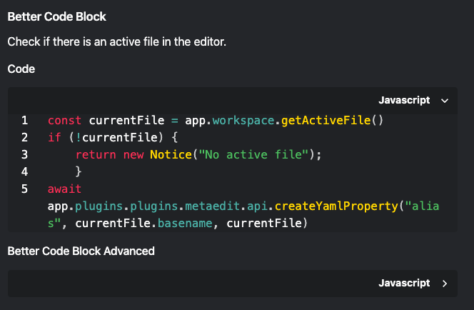
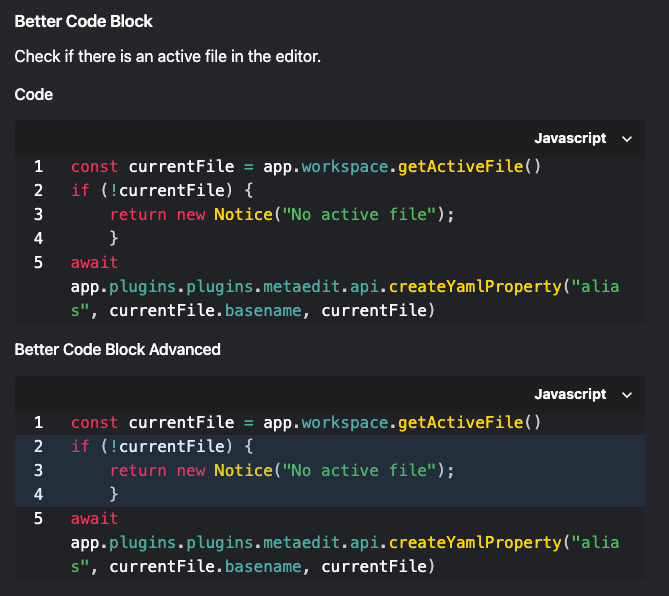
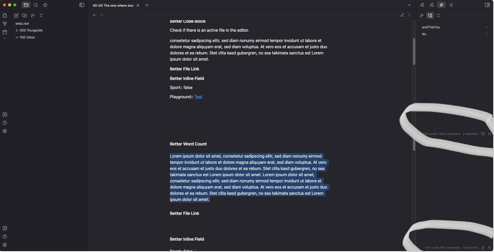
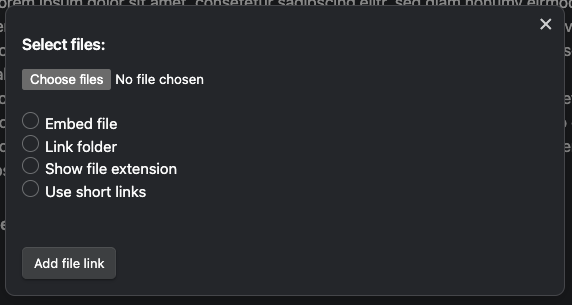
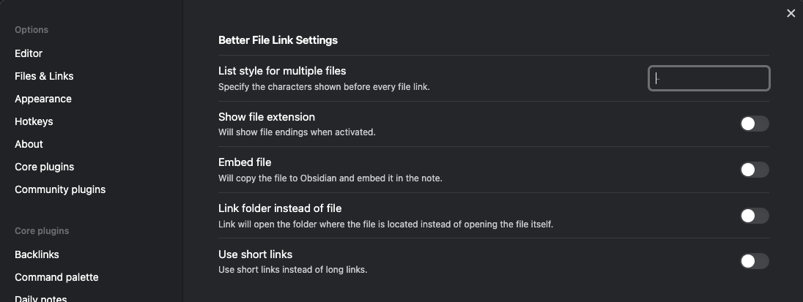
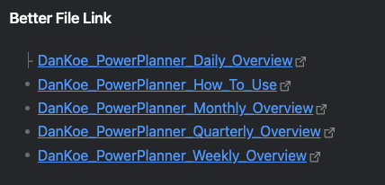
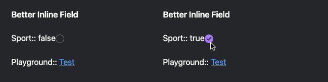
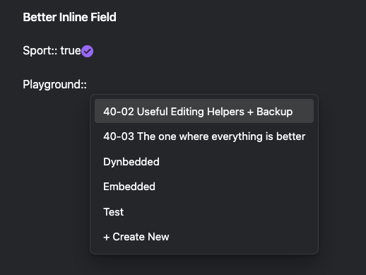
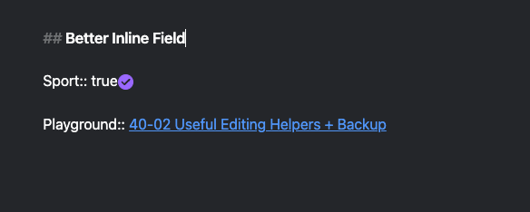

Hello and welcome,

today I want to show you some smaller plugins which all have the word "Better" in the name. Unfortunately some of the plugins aren't maintained, but they work and don't have any bigger issues (At least I don't have any).

I assume in this post that you already know Obsidian and also know how to install community plugins. Feel free to leave comments if you have questions about this.

Let's start with

## Better CodeBlock

The [Plugin was written by Stargrey](https://github.com/stargrey/obsidian-better-codeblock), it isn't maintained though.

It is for the coder among us, who want's to have some more "Style" or for people who publish their vault.

Unfortunately the plugin doesn't work in Preview / Editing Mode.

It has some nice features though:

- Custom Titles for codeblocks
- Highlighting of codelines
- Folding of the codeblock

Better Code Block - Edit View

You can use those additional functions by entering additional information into the first line of the codeblock (there where the language normally is).

- TI: "My Title" - Allows a custom title for the codeblock (it doesn't work for me though)
- HL:"3, 5-8" - Highlights line 3 and 5 to 8
- "FOLD" - folds the codeblock

Better Code Block - Reading View

From time to time you need to close and open the note again to trigger an update.

Better Code Blog - Reading View - Unfoldded

Another plugin out of the category "Works, but isn't maintained".

## Better Word Count

Written by [Luke Leppan Better Word Count](https://github.com/lukeleppan/better-word-count) had in the past a lot more functions then the Core WordCount Plugin which it "replaces"

Unfortunately it does now only do one thing after Obsidian switched to the new editor.

Better Word Count doesn't only show you the number of words and characters in a note, it also allows you to select text and shows you the number of words and characters of the selection.

That helps a lot if you want to know how much fluff was added to the note by frontmatter and so on.

Better Word Count

Let's leave the area of plugins which future is uncertain.

## Better File Link

[Marc Julian Schwarz works on a Plugin](https://github.com/marcjulianschwarz/obsidian-file-link) which allows you to add file links to a note with an easy dialog, which can be triggered via the command palette and can point to the file itself or the directory. (What a long winding sentence.🐛)

You can not select a directory directly, you need to select a file and can then link it to the directory.

Other than that it covers the function which I was looking for. Being able to add links to files without using Drag and Drop, and the capability to make some "configuration" on the fly.

Better File Link

If you don't want to use the command palette you can of course also add a hotkey.

The standard configuration can be changed in the Better File Link Settings. Here is also the place where you can define how a list of file is added. But be warned....

Better File Link Settings

By default you will find a **-**  there, but this is only a suggestion and you still need to configure it.

Better File Link - File List

And the last plugin on the list is a little helper for `#Dataview`

## Better Inline Fields

Written by [David Šarman the Plugin](https://github.com/dsarman/better-inline-fields) is a little helper for `#Dataview` Inline Datafields.

I mainly use it for the capability to click on boolean Datafields and handle them like tasks.

Better Inline Field - Checkboxes

Another function is to get some note suggestions for other specific datafields (which you need to configure), so that you don't need to type [[ ]] all the time and are limited to a specific directory.

Better Inline Field - Note Suggester

Better Inline Fields - Note

It doesn't work together with the [Various Complements Plugin](https://tadashi-aikawa.github.io/docs-obsidian-various-complements-plugin/).

And if you need more functions for Inline Datafields, you should take a look at [Metadata Menu (Plugin)](https://github.com/mdelobelle/metadatamenu), but that doesn't offer the "checkbox" feature.

## Verdict

What do you think about the plugins? Small but interesting plugins which are covering a small niche on it own and which help to ease the work with Obsidian.

Some of those plugins are unfortunately not maintained. This doesn't mean that the plugins don't work or are unusable. But you should ask yourself of course if you want to build your processed on plugins which have bugs for a long time which aren't fixed or which are other issues.

Sometime the developer don't have time for their "hobbies", sometimes the just lost interest.

In the end it will be your decision if you use community plugins. My opinion is that they add a lot of functionality and are worth it to take a closer look at them.

## Conclusion

What do you think about plugin support? Is it fine for you that plugins have bugs for a long time or are not maintained well? Do you know some alternatives?

Let me know in the comments. Not only about these plugins and plugin support, but also if you like my content.

## Fußnote

- [The video to the post](https://youtu.be/iGkRxMp3RbY)
- 40-03
